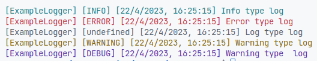

# Js-basiclogger

A basic logger(for now) where show colors in the logs depending of the level.

<br>

# Guide


## Create a logger

```js
const exampleLogger = new Logger("ExampleName");
```

## Log with INFO level

```js
exampleLogger.info("Info type log");
```

## Log with ERROR level

```js
exampleLogger.error("Error type log");
```

## Log with LOG level

```js
exampleLogger.log("Log type log");
```

## Log with WARNING level

```js
exampleLogger.warning("Warning type log");
```

## Log with DEBUG level

```js
exampleLogger.debug("Warning type  log");
```

# Results

